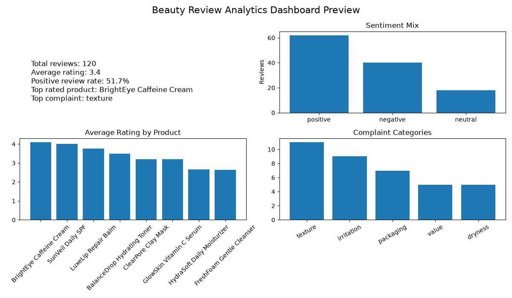
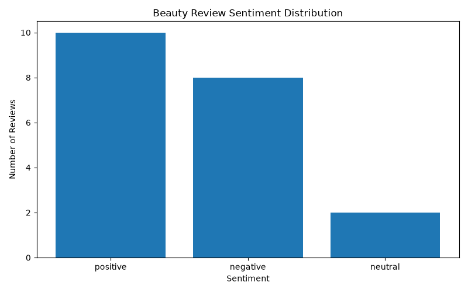
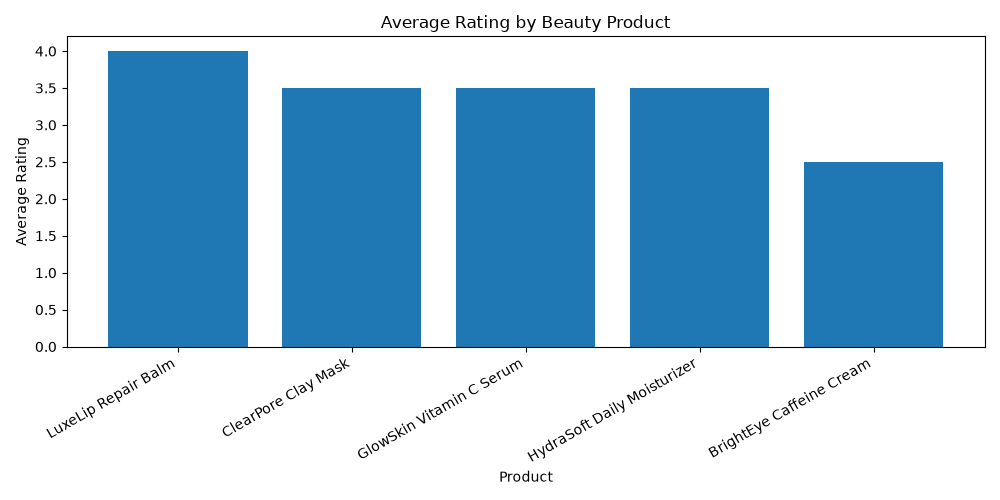
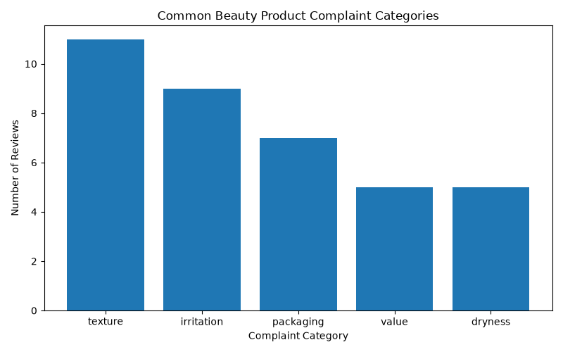
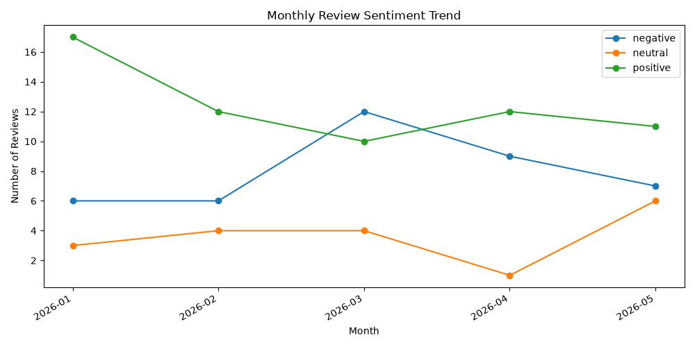

# Beauty Product Review Analyzer

A Python, SQL, and NLP analytics project that analyzes beauty product reviews to uncover sentiment trends, common customer complaints, rating patterns, product-level risks, and business recommendations.

## Project Overview

This project simulates how a beauty brand could analyze customer review data to better understand product performance, customer satisfaction, recurring product issues, and opportunities for product or marketing improvements.

The project uses a synthetic beauty product review dataset and applies data cleaning, rule-based sentiment analysis, machine learning sentiment modeling, complaint categorization, SQL querying, SQLite database creation, and dashboard-ready reporting outputs.

## Why I Built This

I built this project because I am interested in the intersection of beauty, consumer behavior, and data analytics. Beauty brands rely heavily on customer feedback, and review data can reveal patterns that are not always obvious from ratings alone.

This project shows how data can be used to translate customer comments into product insights that support marketing, product development, and customer experience decisions.

## Tools Used

* Python
* Pandas
* NumPy
* Matplotlib
* scikit-learn
* SQL
* SQLite
* Pytest
* Joblib

## Key Features

* Generates a synthetic dataset of 120 beauty product reviews
* Cleans and standardizes customer review text
* Classifies reviews as positive, neutral, or negative
* Detects complaint categories such as irritation, dryness, texture, packaging, and value
* Trains a TF-IDF + Logistic Regression sentiment model
* Creates product-level performance metrics
* Loads review data into a SQLite database
* Generates dashboard-style charts and KPI visuals
* Produces business recommendations from analysis outputs
* Includes unit tests for core cleaning and sentiment logic

## Visual Outputs

### Dashboard Preview



### Sentiment Distribution



### Average Rating by Product



### Complaint Categories



### Monthly Sentiment Trend



## Project Structure

```text
beauty-product-review-analyzer/
├── data/
│   ├── sample_reviews.csv
│   └── cleaned_reviews.csv
├── outputs/
│   ├── beauty_reviews.db
│   ├── review_sentiment.csv
│   ├── product_insights.csv
│   ├── sentiment_summary.csv
│   ├── complaint_summary.csv
│   ├── monthly_sentiment_trend.csv
│   ├── ml_model_metrics.txt
│   ├── ml_sentiment_predictions.csv
│   └── business_recommendations.md
├── screenshots/
│   ├── dashboard_preview.png
│   ├── sentiment_distribution.png
│   ├── average_rating_by_product.png
│   ├── complaint_categories.png
│   └── monthly_sentiment_trend.png
├── sql/
│   ├── schema.sql
│   └── analysis_queries.sql
├── src/
│   ├── generate_sample_data.py
│   ├── clean_reviews.py
│   ├── sentiment_analysis.py
│   ├── review_insights.py
│   ├── ml_sentiment_model.py
│   ├── database.py
│   └── business_recommendations.py
└── tests/
    ├── test_clean_reviews.py
    └── test_sentiment_analysis.py
```

## Sample Business Questions

This project answers questions such as:

* Which beauty products have the highest average ratings?
* What percentage of reviews are positive, neutral, or negative?
* What complaints appear most often in negative reviews?
* Which products have the highest negative review rate?
* How does sentiment change across review periods?
* How can customer feedback be turned into product and marketing recommendations?

## Data Process

1. Generated synthetic beauty product review data
2. Cleaned missing values, ratings, dates, and review text
3. Created cleaned review text and review length fields
4. Applied rule-based sentiment classification
5. Labeled complaint categories using keyword patterns
6. Trained a TF-IDF + Logistic Regression sentiment model
7. Generated product-level insight tables
8. Loaded the final dataset into a SQLite database
9. Created visualizations for sentiment, ratings, complaints, and trends
10. Produced business recommendations based on analysis outputs

## Machine Learning Approach

The machine learning portion uses a text classification pipeline:

* TF-IDF vectorization to transform review text into numeric features
* Logistic Regression to classify review sentiment
* Train/test split for evaluation
* Accuracy score and classification report saved in `outputs/ml_model_metrics.txt`
* Test predictions saved in `outputs/ml_sentiment_predictions.csv`

This keeps the model explainable while still demonstrating a real NLP workflow.

## Model Results

The model achieved strong performance on the synthetic test dataset.

Model output is saved in:

```text
outputs/ml_model_metrics.txt
```

The saved report includes:

* Test accuracy
* Precision
* Recall
* F1-score
* Classification report by sentiment class

## Business Recommendations

The project generates a recommendation report at:

```text
outputs/business_recommendations.md
```

The report summarizes:

* Positive review rate
* Highest-rated product
* Product with the highest negative review rate
* Most common complaint category
* Recommended product and marketing actions

## How to Run This Project

Install dependencies:

```bash
python -m pip install -r requirements.txt
```

Generate sample review data:

```bash
python src/generate_sample_data.py
```

Clean the review data:

```bash
python src/clean_reviews.py
```

Run rule-based sentiment analysis:

```bash
python src/sentiment_analysis.py
```

Generate insights and charts:

```bash
python src/review_insights.py
```

Train the ML sentiment model:

```bash
python src/ml_sentiment_model.py
```

Create the SQLite database:

```bash
python src/database.py
```

Generate business recommendations:

```bash
python src/business_recommendations.py
```

Run tests:

```bash
python -m pytest
```

## SQL Analysis

The `sql/analysis_queries.sql` file includes queries for:

* Average rating by product
* Sentiment distribution
* Complaint category frequency
* Negative review rate by product

## Future Improvements

* Use real public review data from beauty retailers
* Add transformer-based NLP sentiment classification
* Build an interactive Streamlit dashboard
* Add product category filters
* Connect the analysis to a cloud database
* Compare review trends across brands and time periods

## Skills Demonstrated

* Data cleaning
* Exploratory data analysis
* Natural language processing
* Machine learning text classification
* SQL querying
* SQLite database creation
* Business insight generation
* Data visualization
* Python testing
* Portfolio-ready documentation
